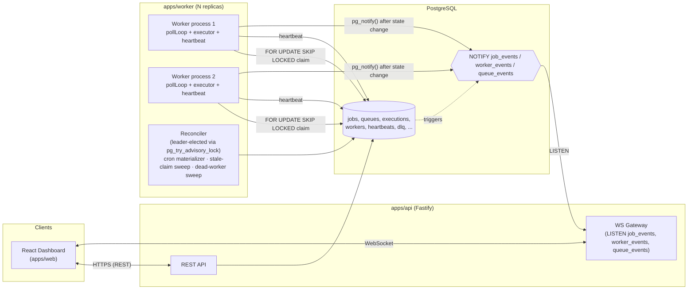

# Architecture

## System overview

Codity is split into three independently deployable processes plus two shared
libraries, wired together entirely through Postgres — no message broker, no
Redis, no separate coordination service.

## Why this shape

**Three processes, one database, zero extra infrastructure.** `apps/api` and
`apps/worker` are independent Node processes that can be scaled, deployed, and
restarted separately — killing a worker never affects API availability, and
vice versa. This is what "distributed" means concretely in this system: any
number of `apps/worker` replicas can run against the same Postgres instance
and safely compete for the same jobs (see `claimJobs` in
[design-decisions.md](./design-decisions.md)).

**Postgres is the coordination substrate, not just storage.** Three Postgres
primitives do work that would otherwise require a message broker or
distributed lock service:
- `FOR UPDATE SKIP LOCKED` — atomic, race-safe job claiming across N workers.
- `pg_try_advisory_lock` — leader election for the reconciler, so cron
  materialization and dead-worker detection run exactly once across the fleet.
- `LISTEN` / `NOTIFY` — cross-process pub/sub bridging worker-originated state
  changes to the API process holding live WebSocket connections.

This keeps the system to a single moving part to operate (Postgres) while
still being genuinely concurrent and fault-tolerant.

## Request/data flow (a job's life)

1. **Create**: `apps/web` → `apps/api` REST call → `Job` row inserted
   (`QUEUED` or `SCHEDULED` depending on type).
2. **Promote**: every worker's poll tick promotes due `SCHEDULED` jobs to
   `QUEUED` (cheap, idempotent, no leader election needed).
3. **Claim**: a worker calls the atomic claim query, which locks and updates
   up to N due `QUEUED` rows to `CLAIMED`, bounded by the queue's
   `concurrencyLimit`.
4. **Execute**: the worker sets `RUNNING`, creates a `JobExecution` row, runs
   the registered handler, writes `JobLog` rows as it goes.
5. **Finish**: on success → `COMPLETED`. On failure with attempts remaining →
   back to `SCHEDULED` with a retry-policy-computed `runAt`. On failure with
   attempts exhausted → `DEAD_LETTER` + a `DeadLetterEntry`.
6. **Notify**: every transition fires `pg_notify`, which `apps/api`'s single
   LISTEN connection fans out to subscribed WebSocket clients so the dashboard
   updates within roughly a second, without polling.
7. **Reconcile**: independently of any single job, the leader-elected
   reconciler sweeps for orphaned claims (worker died mid-job), dead workers
   (missed heartbeats), and jobs permanently blocked on a dependency that
   dead-lettered or was cancelled (bonus: workflow dependencies — see below),
   requeuing/repairing/cancelling state every ~30s.

## Bonus features and where they live

- **Workflow dependencies**: a job created with `dependsOnJobIds` starts
  `SCHEDULED` and is only promoted to `QUEUED` once every dependency reaches
  `COMPLETED` — enforced by extending the existing promotion gate
  (`promoteScheduledJobs.ts`), not the claim query. A dependency that
  dead-letters or is cancelled instead cascades a `CANCELLED` onto its
  blocked dependents via the reconciler. See design-decisions.md for the full
  reasoning and its one documented scope boundary.
- **AI-generated failure summaries**: `apps/api/src/services/dlqService.ts`
  calls the Claude API (single request/response, no agent loop) with the
  job's payload, error, stack trace, and recent logs, constrained to a JSON
  schema (`summary`/`likelyCause`/`suggestedFix`/`severity`). Cached on
  `DeadLetterEntry.aiSummary` so repeat views don't re-call the API.
- **Live pipeline/topology view**: `apps/web/src/routes/Pipeline.tsx` is a
  pure frontend visualization — queues → workers → completion/DLQ — driven
  entirely by the same WebSocket events the rest of the dashboard already
  consumes. No new backend surface.
- **RBAC, rate limiting, WebSocket live updates**: see `docs/api.md`'s
  conventions section and `apps/api/src/middleware/rbac.ts`.

## Deployment topology

Each of `apps/api`, `apps/worker`, `apps/web` ships with its own `Dockerfile`
and can be scaled independently (`apps/worker` is the one expected to scale
horizontally — run as many replicas as needed, they coordinate purely through
Postgres). `docker-compose.yml` provides local Postgres; a production
deployment would point `DATABASE_URL` at a managed Postgres instance and run
N worker replicas behind no load balancer (workers are pull-based, not
pushed-to).
