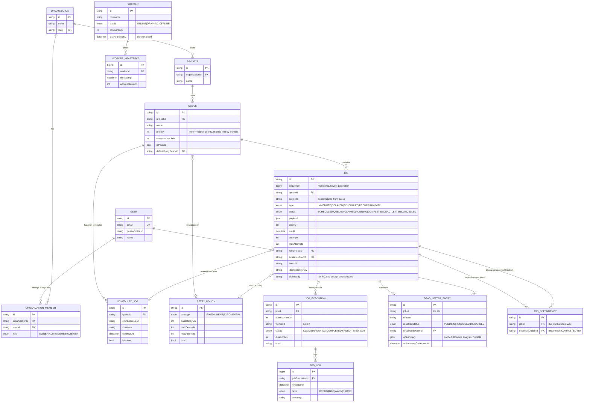

# Entity-Relationship Diagram

Derived from [`packages/db/prisma/schema.prisma`](../packages/db/prisma/schema.prisma).

## Key design notes

- **`Job.projectId` is a deliberate denormalization** from `Queue.projectId`.
  The global job explorer filters/paginates by project on every request; without
  this, every list query needs a join through `Queue`. It's set once at job
  creation and never mutated, so there's no sync-drift risk.
- **`JobExecution` is split from `Job`** rather than storing the last attempt's
  result on `Job` directly. A job can be attempted N times; `JobExecution` is
  the durable per-attempt record (worker, timing, error, result), which is what
  makes "retry history" and "execution metrics" — both explicit spec
  requirements — a clean indexed query instead of overloading `Job`.
- **`Worker.lastHeartbeatAt` is denormalized** from `WorkerHeartbeat` (the
  append-only history table) so "is this worker dead" is a cheap indexed
  point-lookup on `Worker`, not a `MAX()` aggregate over heartbeat history on
  every dashboard poll.
- **`Job.claimedBy` and `JobExecution.workerId` are plain string references,
  not enforced foreign keys** to `Worker`. Pruning a stale/offline worker row
  must never cascade-delete job history — these fields are set to `null`
  instead when a worker is cleaned up.
- **Cascades**: `Organization → Project → Queue → Job → JobExecution → JobLog`
  all cascade on delete (deleting an org legitimately removes its whole data
  tree). `JobDependency` cascades on both `Job` sides (`jobId` and
  `dependsOnJobId`) — deleting either job in a dependency pair removes the
  edge, never the other job. `OrganizationMember` cascades on both
  `Organization` and `User` sides (deletes only the membership row, never the
  other party's data). Actor references like `DeadLetterEntry.resolvedByUserId`
  use `SET NULL` so audit history survives user deletion.
- **`JobDependency` (bonus: workflow dependencies)** is a plain edge table —
  one row means "`jobId` cannot be claimed until `dependsOnJobId` reaches
  `COMPLETED`." It's enforced entirely by extending the existing
  `SCHEDULED`→`QUEUED` promotion gate (`promoteScheduledJobs.ts`), not by
  touching the atomic claim query; see design-decisions.md for why that's the
  sound place to enforce it. Indexed on both `jobId` and `dependsOnJobId`
  since both lookup directions ("my dependencies" and "who depends on me")
  are queried by the API and the reconciler's cascade-cancel sweep.
- **`DeadLetterEntry.aiSummary` (bonus: AI-generated failure summaries)** is
  cached JSON, nullable until a summary is generated. It's populated on
  demand (`POST /dlq/:jobId/ai-summary`), not eagerly on every dead-letter
  event, since the Claude API call is comparatively slow/costly and most
  dead-lettered jobs are resolved by a human without ever asking for one.

## Indexing strategy

| Index | Table | Purpose |
|---|---|---|
| `(queueId, status, priority, runAt)` | `Job` | The atomic claim query's hot path |
| `(projectId, status, createdAt)` | `Job` | Dashboard job explorer filtering/pagination |
| `(queueId, status)` | `Job` | Per-queue stats (busy count, status breakdown) |
| `(projectId, priority)` | `Queue` | Worker poll loop's priority-tiered queue scan |
| `(isActive, nextRunAt)` | `ScheduledJob` | Cron materializer's due-template scan |
| `(status, lastHeartbeatAt)` | `Worker` | Dead-worker detection sweep |
| `(jobId)`, `(dependsOnJobId)` | `JobDependency` | Both dependency-lookup directions |
| `(workerId, timestamp DESC)` | `WorkerHeartbeat` | Per-worker heartbeat history/sparkline |
| `(jobExecutionId, timestamp)` | `JobLog` | Ordered log retrieval for a single execution |
